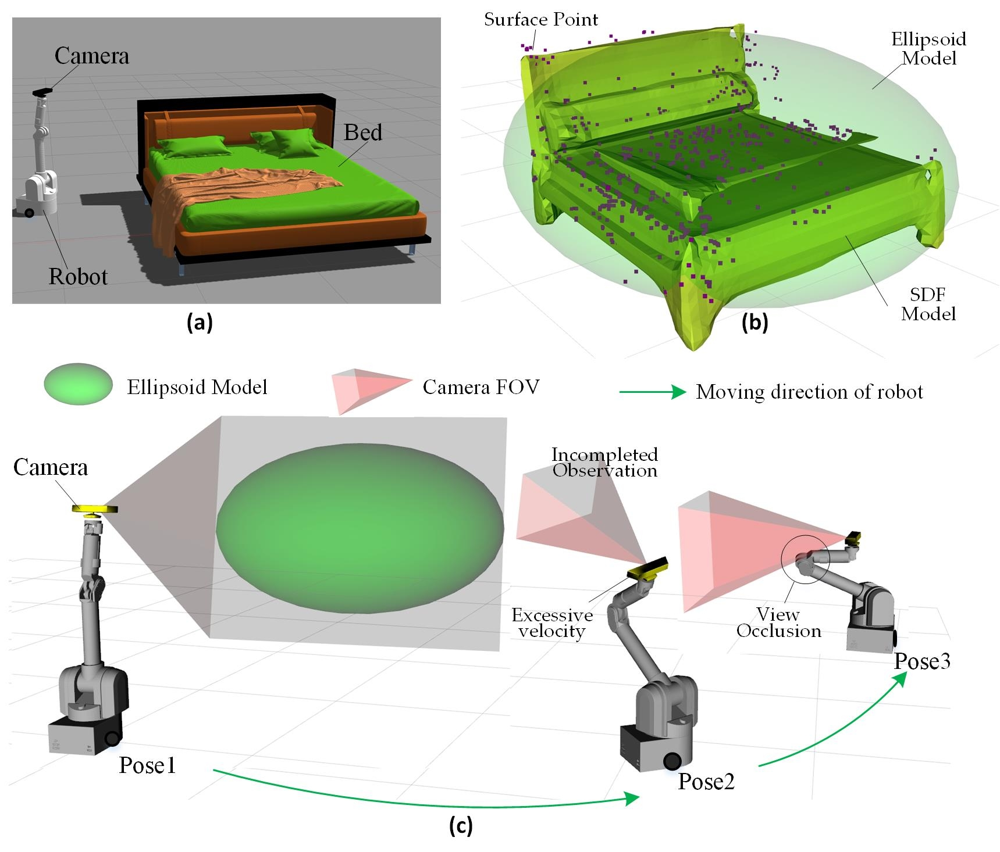
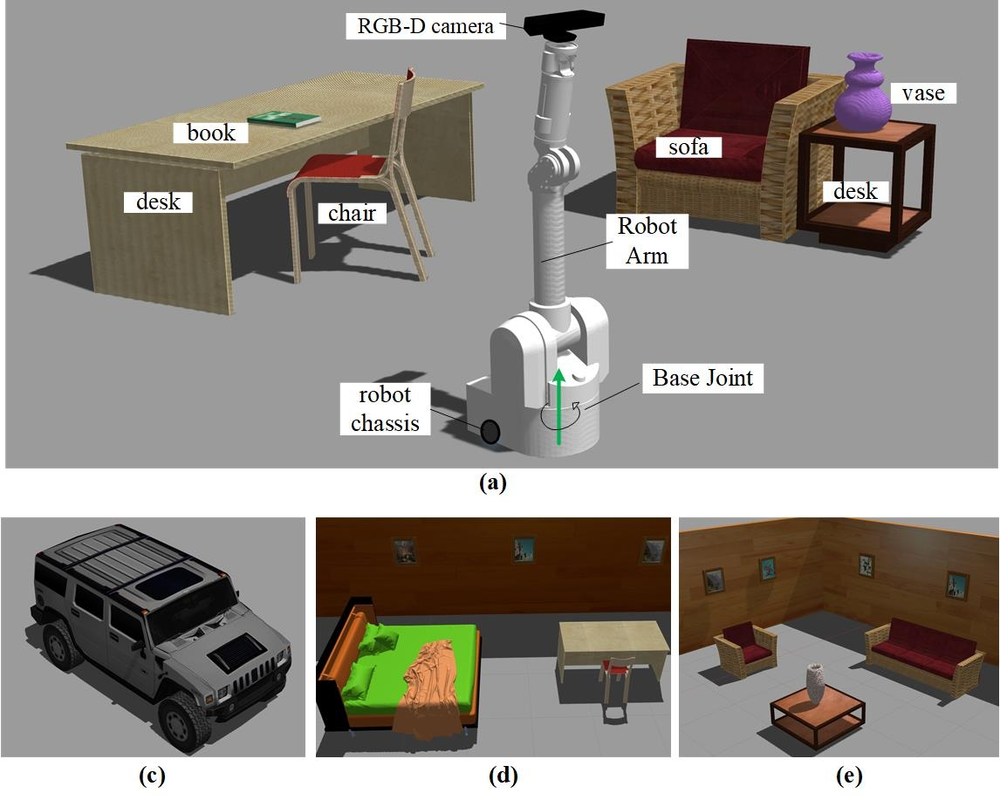
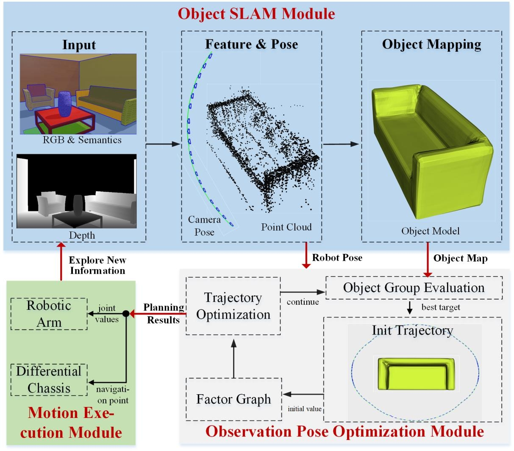

# Observation Pose Optimization 
**Authors:** [Zhang Jiadong]

Robot Observation Pose Optimization for Active Object SLAM with Ellipsoid Model and Camera Field of View.
   <figure>
    <p align="center" >
    
    </p>
    </figure>

## 1. Prerequisites

We have tested the system in Ubuntu 20.04.
    + ROS noetic for Motion module and the connection between Motion module&View-Planning module. We suggest installing the "desktop-full" version of ROS.
    + Moveit for robotic arm control.
    + Prerequisites of optimization module are the same as [**GPMP2**](https://github.com/borglab/gpmp2.git).
    + Gazebo 9.0 for Simulization environment. 
    + Rviz for visulization of object map, camera view and robot motion.


## 2. Building

  + Create ROS workspace and download our package:
        
        cd {ROS_WORKSPACE}/src
        git clone https://github.com/TINY-KE/OPO_ASLAM.git       
        
  + Complie:
        
        cd {ROS_WORKSPACE}
        catkin_make
    

## 3. Simulization Environment and Fabo robot
  + bedroom
  
    ```
    roslaunch wam_arm_moveit wam_kinectv1_bringup_moveit_bedroom.launch 
    ```

  + livingroom
  
    ```
    roslaunch wam_arm_moveit wam_kinectv1_bringup_moveit_livingroom.launch 
    ```

  + SUV

    ```
    roslaunch wam_arm_moveit wam_kinectv1_bringup_moveit_suv.launch 
    ```
    <figure>
    <p align="center" >
    
    </p>
    </figure>

## 5. Test the Active SLAM
+ 1. Active SLAM
  + Control robot by keyboard. This corresponds to manual mode where PubGlobalGoal=0. Press "WADX" to control the movement of the chassis. Press "S" to save the groudtruth of trajectory.
    
    ```
    rosrun view_planning QF-ASLAM
    ```

    <figure>
    <p align="center" >
    
    </p>
    </figure>

+ 2. Publish Object Information

    In my paper, an improved object SLAM based on [**DSP-SLAM**](https://github.com/JingwenWang95/DSP-SLAM) is used to send object information. This part of the work is not open-source. Readers can manually send object information.

    ```
    view_planning pub_object_debug  num_of_objects     x1 y1 z1 r1 p1 y1 w1 h1 l1     x2 y2 z2 r2 p2 y2 w2 h2 l2         ....  
    ```


    Example of bedroom
    
    ```
    rosrun view_planning pub_object_debug 2    3.5 0 0.75 0 0 0  2.6 3 1.5       3.7 -4 0.6 0 0 0  1.2 2.3 1.2
    ```   

    Example of livingroom
    
    ```
    rosrun view_planning pub_object_debug 3    2 0 0.6 0 0 0  1.4 1.4 1.4       1.5 -2.5 0.6 0 0 0  1.4 1.4 1.4    4 -2.5 0.6 0 0 0  1 2 1.3
    ```   

    Example of SUV
    
    ```
    rosrun view_planning pub_object_debug 1    5 0 1.2 0 0 0  3 6 2.4 
    ```   
    
